### Daou Internship project

## List

1. Title
2. Usage Commit Search
3. Mission Description
4. Server Structure
5. Log Parsing
6. Additional Requirements
7. (expect) Class Diagram 

## 1. Log Collector

* Log data를 수집하는 기능을 하는 어플리케이션입니다. 

## 2. Usage commit search

**For easy commit searching**

`***` -> very important commit (ex. main function, main issue etc...)

`**` -> a little important commit (ex. exchange method ...)

`*` -> not important, but don't miss (etc....)

## 3. Mission Description

### 1. 전체적인 데이터 구조

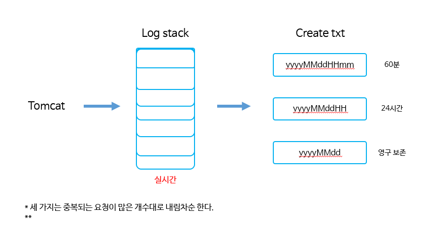

1. 서버에 지속적으로 access-* log 파일이 생성된다. 
2. 그 파일들을 읽으면서 나의 local 폴더에 txt 파일을 생성한다. 

 

### 2. 전체적인 흐름

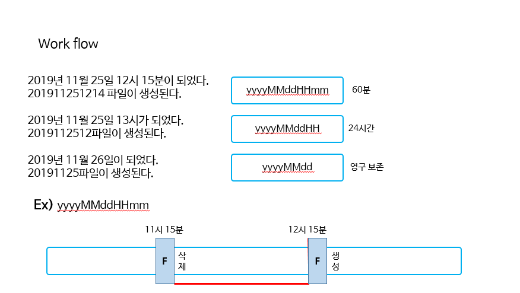

1. 실시간으로 로그데이터를 저장할 때 위의 로직을 따른다. 
2. temp_log_file에 분 파일에 해당하는 분의 모든 로그들이 저장된다. 
3. 15분이 되면, 저장되고 있던 temp_log_file에 있는 14분 파일은 real_log_file로 저장된다. 
4. 분 파일은 real_log_file에 완전히 생성된 후에 `60분` 후에 삭제된다. 
5. 59분 까지의 분 파일이 생기고 00분이 되면 해당 12시의 파일이 생성된다. (마찬가지로 24시간 후에 삭제된다.)
6. 23시 59분 --> 00:00이 되면서 분 파일은 합쳐져 시간파일이 되고, 시간 파일은 합쳐져 날짜 파일이 된다. 
7. 실시간으로 저장되는 로직은 위와 같이 움직인다. 과거로 돌아거가나 하는 일은 없다. 

 

### 3. Log의 형식

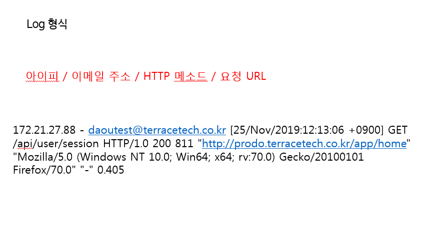

1. 로그의 형식은 위와 같다. `ip`, `email`, `httpMethod`, `time` , `requestUri` 로 구성되어 있다. 

 

### 4. 결과

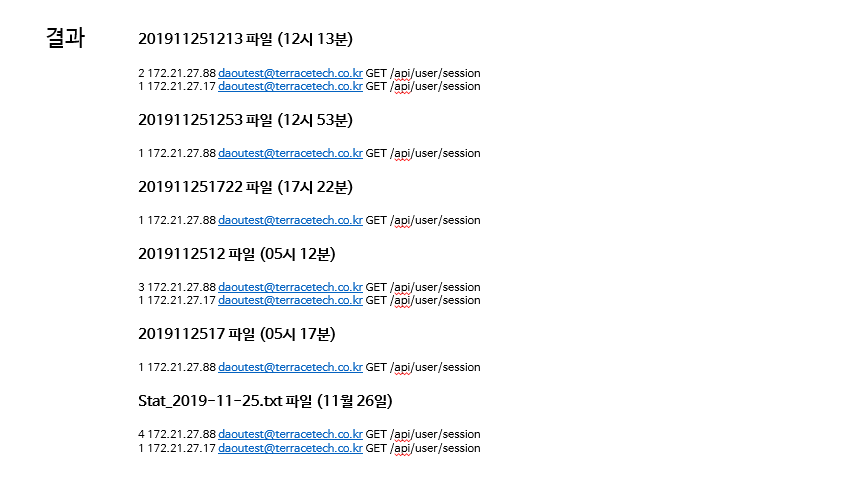

1. 결과는 위와 같이 나타난다. 
2. 조건 1) 중복되는 요청이 많은 순서대로 내림차순한다. 
3. 조건 2) `ip`, `email`,`httpMethod`, `requestUri` 중 하나라도 없다면 로그 데이털르 저장하지 않는다. 

---

 

## 4. Server structure

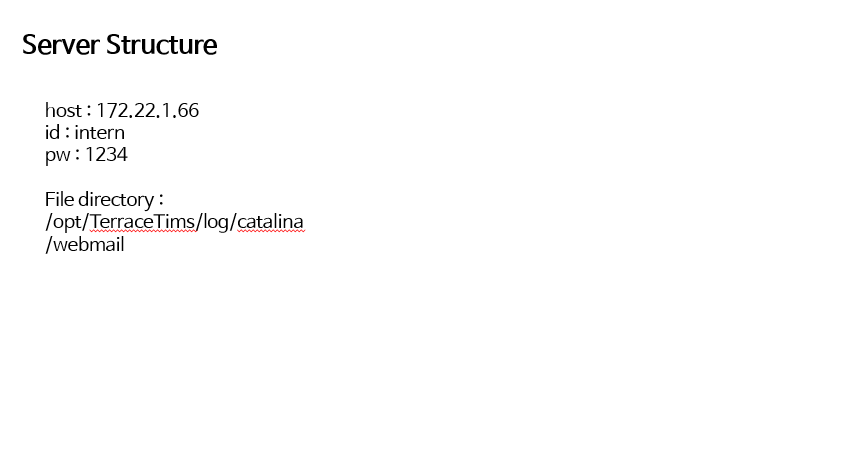

1. teraterm을 이용하여 접근 가능

---

 

## 5. Log Parsing

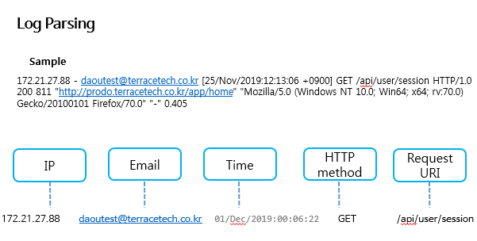

 

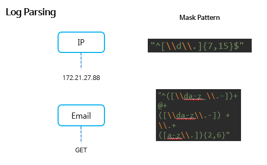

 

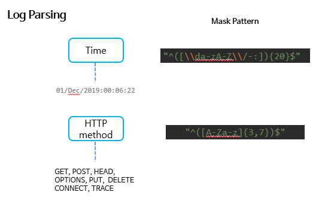

---

 

## 6. Additional Requirements

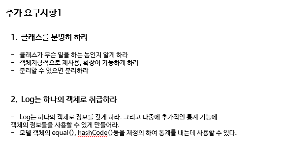

 

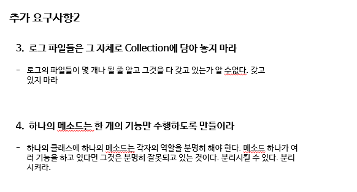

 

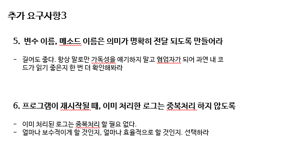